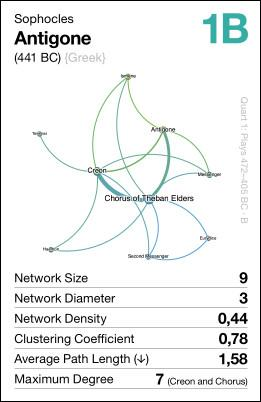
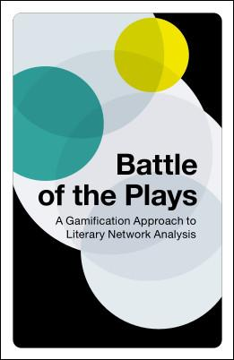
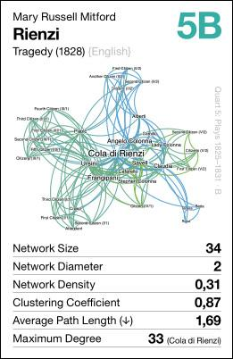

## Battle of the Plays
### A Gamification Approach to Literary Network Analysis

On this page you can find the rules for our card game “Battle of the Plays”. Each of the 32 cards depicts a social network extracted from a play, based on the co-presence of characters.

### The Card Game

Frank Fischer, Mark Schwindt: **Battle of the Plays. A Gamification Approach to Literary Network Analysis.** Berlin: SUKULTUR 2024. – 32+1 cards including case, color print. ISBN: 978-3-95566-182-3. **€15,00.** (order here)

The cards are published under Creative Commons license [CC0 1.0](https://creativecommons.org/publicdomain/zero/1.0/) and can be downloaded for self-printing and customisation [here](pdf/battle_of_the_plays_web_version.pdf).

### This Is the Idea

The network analysis of literary texts is a complex endeavour. Not only the automated extraction of social networks from texts but also the interpretation of calculated values is a demanding task.

For example, what does it really mean that the average path length for Shakespeare’s “Hamlet” is 1.7? However, if we put this value in relation to corresponding values of other plays, it gains comparative significance.

This card game aims to playfully develop a feeling for the meaning of such values. Toying around with social networks extracted from European drama can even contribute to your cultural knowledge about networks in general.

### Defining a Minimal Canon

The 32 cards assemble a minimal canon of European drama, reaching from antiquity up to the modern age (from the Greeks to Beckett).

Instead of lexicon-like descriptions of such a canon, our analytical instrument consists of graph visualisations and network values that produce comparability – which makes for a competitive game.

When selecting the plays for this poster, we tried to be diverse and inspiring, with a focus not necessarily on comparable literary quality, but on interesting literary network data. We included plays written in 12 original languages: Dano-Norwegian, English, Finnish, French, German, Greek, Hungarian, Italian, Romanian, Russian, Spanish, and Swedish. Node labels are usually in English (taken from translations of the plays or translated by us).

### Turning Plays into Data

The extraction of character relations follows a simple operationalisation: every speaking character or entity of a play is transformed into a node in the corresponding network graph. A relation between two nodes is established if the two characters in question perform a speech act in the same segment (usually a scene).

The size of nodes and labels corresponds to the weighted degree of a character. Also, the more often two characters appear together as speakers in a scene, the thicker the edge between them in the graph visualisation.

Graphs were post-processed with [Gephi](https://gephi.org/) using “Force Atlas 2” as default layout algorithm. The colour gradient from red to blue indicates different communities distinguished from each other by employing standard threshold values. This division does not have to be meaningful per se.

### Network Graphs and Values

A graph of the extracted drama network serves as visual catch. The other info on the cards comprises metadata (author – title – subtitle/genre – year – original language) plus network data:

- **Network Size**: The number of speaking characters/entities in a play.
- **Network Diameter**: The highest value among all shortest distances between two nodes.
- **Network Density**: A value between 0 and 1 that indicates how many of all possible connections between nodes are actually realised. This value tends to be significantly different in comedies and tragedies: the latter are on average less dense than the former (in individual cases this may vary).
- **Clustering Coefficient**: Another value between 0 and 1, determined by the ratio of the possible number of “triangles” in a network to actually connected triplets.
- **Average Path Length**: Each pair of nodes in a connected network has a shortest path length. The APL calculates the average of all shortest path lengths.
- **Maximum Degree**: The degree of a node is defined as the number of direct connections to other nodes. The maximum degree indicates the value for the character with the most connections (incl. the name of this character in brackets).

### Rules of Play

The card deck is an entirely solid [quartette game](https://en.wikipedia.org/wiki/Quartets_(card_game)). However, the recommended playing mode is “Top Trumps”, general rules can be found [on Wikipedia](https://en.wikipedia.org/wiki/Top_Trumps). In principle, players can decide for themselves which value is considered “better”. We suggest that the higher value trumps for Network Size, Network Diameter, Network Density, Cluster Coefficient, and Maximum Degree. The lower value trumps for Average Path Length.

### Behind the Stage

The predecessor of this card game with 32 German-language plays was released under the title [“Dramenquartett”](https://dramenquartett.github.io/) at the DHd2018 conference in Cologne on March 1, 2018, and won the Best Poster Award. Plans to craft a version of the game revolving around European drama already originated in mid-November 2017 at the TEI conference in Victoria, British Columbia. The actual work started at the end of March 2018 in the “Why Not” cafe at the Danube embankment in Budapest and continued in April and May at “Café Caspar” in Vienna. The original name of the international version of the game was “Brecht Beats Shakespeare!”, and it was released as a poster at DH2018 in México City ([doi:10.6084/m9.figshare.6667424](https://doi.org/10.6084/m9.figshare.6667424)). We had a few copies of the card game printed (see [here](https://x.com/angelikah/status/1012100869301702657)), but never managed to publish it. Work resumed in early summer 2024 at Freie Universität Berlin, between a team lunch at [Mensa FU II](https://www.stw.berlin/mensen/einrichtungen/freie-universit%C3%A4t-berlin/mensa-fu-ii.html) and a [fritz-kola super zero](https://fritz-kola.com/de/produkte/kola-super-zero) at “Café Kauderwelsch”. We gave the cards a fresh look and agreed with [SUKULTUR](https://sukultur.de/), the Berlin-based publishing house, to print a first edition.

### References
- [card-game data](https://github.com/lehkost/dramenquartett/tree/master/dh2018-mexico) (as printed on the cards)
- data sources: [DraCor](https://dracor.org/) and [ezlinavis](https://ezlinavis.dracor.org/)

### Credits
- [Frank Fischer](https://lehkost.github.io/)
- [Mark Schwindt](https://www.markschwindt.com/)

### “Battle of the Plays” Championships
- [Potsdam, 10 December 2019](https://x.com/peertrilcke/status/1204410193812971522) ([winner](https://x.com/jbyszuk/status/1204415618339885070))
- [Vienna, 12 June 2024](https://x.com/DH_Potsdam/status/1800889495501553978) ([winner](https://x.com/DH_Potsdam/status/1800894501822796084))

### Thanks
A big shout out to the entire team of [Research Area 5](https://www.temporal-communities.de/research/digital-communities/index.html) of EXC 2020 “Temporal Communities”.
